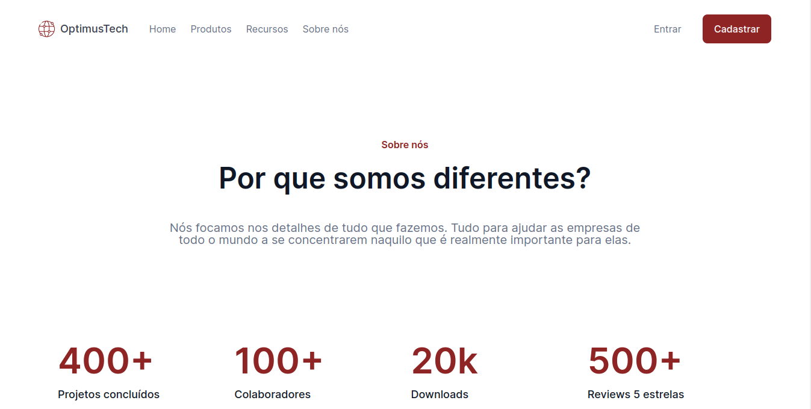

# OptimusTech 🌐

Optimus Tech é uma página web completa para desktop e se trata de um desafio final para Formação HTML e CSS da Alura no #7DaysOfCode, onde cada dia é proposto para o aluno realizar uma parte da página. 

## Projeto (Screenshoot)📸

> Em Desenvolvimento: 🛠

## Tecnologias 💻

* HTML
* CSS

## Recursos utilizados 📗

* Flexbox
* Naming Convertion - BEM
